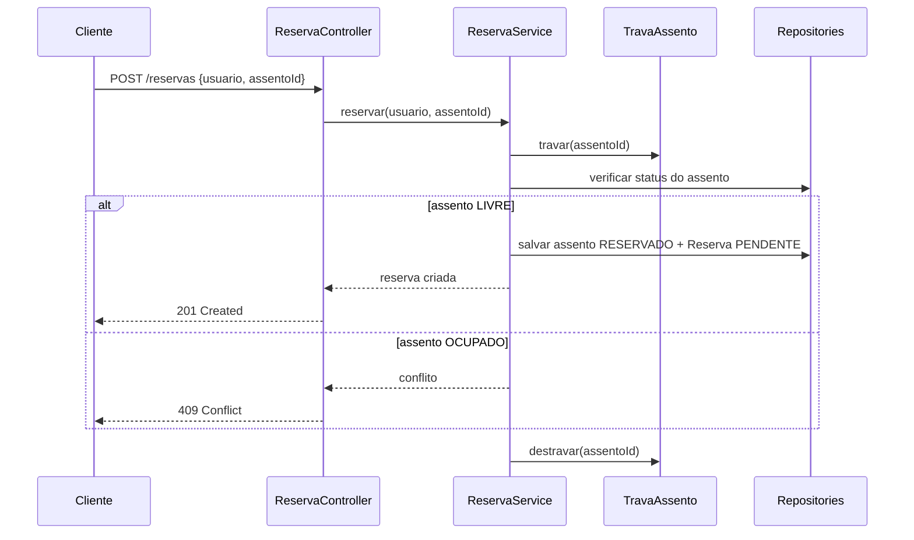
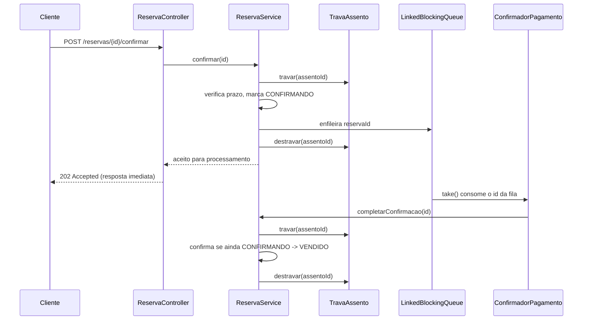
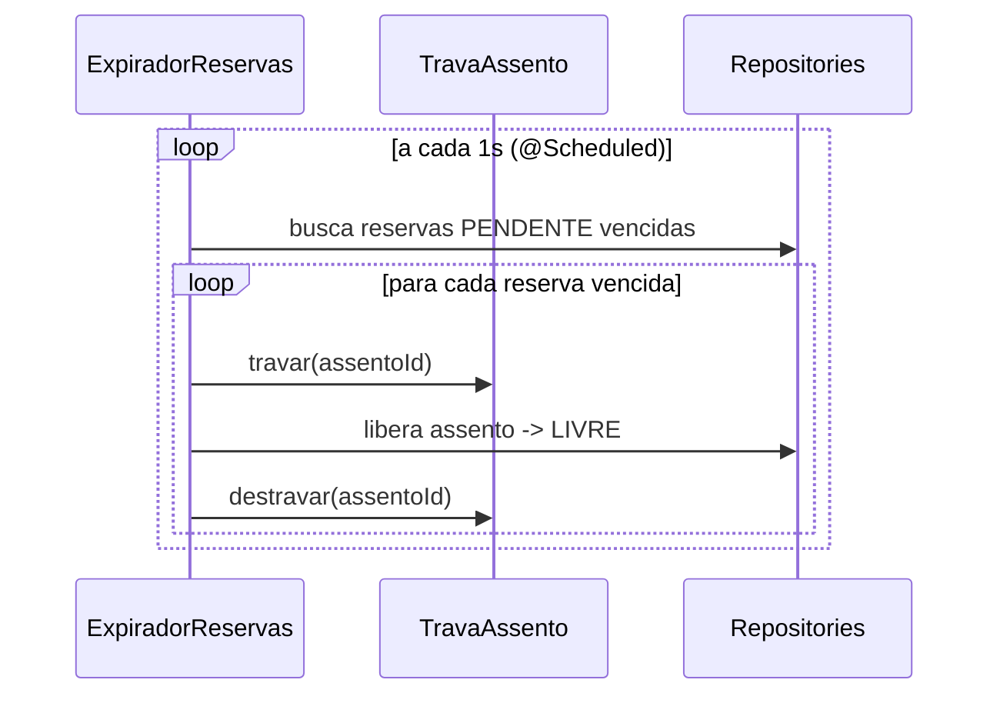

# TicketFlow

Protótipo single-node de reserva de assentos com concorrência real, em Java 21 e Spring Boot 4. Vários clientes podem disputar o mesmo assento; os modos de sincronização demonstram o problema de overbooking e sua solução. A API usa HTTP e JSON. Front-end, autenticação, banco externo e pagamento real estão fora do escopo desta entrega.

## Requisitos

- JDK 21+ (`java -version`)
- Internet na primeira execução: o `mvnw`/`mvnw.cmd` baixa Maven e dependências, sem precisar instalar Maven separadamente.

## Rodando

```
# Windows
.\mvnw.cmd spring-boot:run
```

```
# Mac/Linux
./mvnw spring-boot:run
```

Servidor em `http://localhost:8080`.

## Testes

```
.\mvnw.cmd test
```

No Mac/Linux, use `./mvnw test`.

| Classe                       | Quantidade | O que verifica                                                              |
| ---------------------------- | ---------- | ---------------------------------------------------------------------------- |
| `ReservaServiceTest`         | 10         | Regras de reserva, confirmação, cancelamento e expiração sem subir o Spring |
| `ConcorrenciaTest`           | 3          | Disputa por um assento com 300 threads virtuais, nos três modos             |
| `ReservaControllerTest`      | 6          | Integração HTTP real via `@SpringBootTest` e `TestRestTemplate`             |
| `TicketFlowApplicationTests` | 1          | Inicialização do contexto Spring                                            |

Total: 20 testes. O teste de concorrência usa `CountDownLatch` para sincronizar a largada: `SEM_TRAVA` permite mais de uma reserva bem-sucedida para o mesmo assento, enquanto `TRAVA_GLOBAL` e `TRAVA_POR_ASSENTO` permitem exatamente uma.

## Configuração

Em `src/main/resources/application.properties` ou por variável de ambiente (por exemplo, `TICKETFLOW_MODO_SINCRONIZACAO`):

| Propriedade                           | Padrão              | Valores ou finalidade                            |
| -------------------------------------- | -------------------- | -------------------------------------------------- |
| `server.port`                         | `8080`              | Porta HTTP                                       |
| `ticketflow.modo-sincronizacao`       | `TRAVA_POR_ASSENTO` | `SEM_TRAVA`, `TRAVA_GLOBAL`, `TRAVA_POR_ASSENTO` |
| `ticketflow.quantidade-assentos`      | `50`                | Assentos criados na inicialização                |
| `ticketflow.quantidade-trabalhadores` | `4`                 | Workers de confirmação                           |
| `ticketflow.ttl-reserva-segundos`     | `30`                | Prazo da reserva                                 |
| `ticketflow.intervalo-expiracao-ms`   | `1000`              | Intervalo de verificação de reservas vencidas    |

Com `spring.threads.virtual.enabled=true`, o servidor atende requisições HTTP em virtual threads.

## Demonstração de concorrência

Com o servidor no modo `SEM_TRAVA`, envie requisições simultâneas a `POST /reservas` para o mesmo `assentoId`. Mais de uma pode receber `201 Created`: é o overbooking demonstrado pelo projeto. Nos modos protegidos, só uma tem sucesso. O teste `ConcorrenciaTest` reproduz o cenário com 300 threads virtuais.

| Modo                | Comportamento                                                        | Resultado para o mesmo assento                                       |
| -------------------- | ---------------------------------------------------------------------- | ------------------------------------------------------------------------ |
| `SEM_TRAVA`         | Nenhuma trava; pausa artificial de 20 ms entre verificar e escrever | Mais de uma reserva pode ter sucesso                                |
| `TRAVA_GLOBAL`      | Um `ReentrantLock` para todo o sistema                              | Exatamente uma reserva; assentos diferentes também disputam a trava |
| `TRAVA_POR_ASSENTO` | Um `ReentrantLock` por assento                                      | Exatamente uma reserva, com paralelismo entre assentos diferentes   |

No modo sem trava, várias threads podem verificar que o assento está `LIVRE` antes que qualquer uma altere seu estado. A quantidade de sucessos pode variar entre execuções.

## Endpoints

| Método | Rota                       | Descrição                                             | Respostas principais                           |
| ------- | --------------------------- | -------------------------------------------------------- | --------------------------------------------------- |
| GET    | `/saude`                   | Status do serviço                                     | `200`                                          |
| GET    | `/assentos`                | Lista todos os assentos                               | `200`                                          |
| POST   | `/reservas`                | Cria reserva com `{"usuario": "ana", "assentoId": 3}` | `201`, `409` se ocupado, `422` se inválido     |
| POST   | `/reservas/{id}/confirmar` | Agenda confirmação do pagamento                       | `202`, `404` se não existir, `409` se expirada |
| DELETE | `/reservas/{id}`           | Cancela a reserva                                     | `204`, `404` se não existir                    |

Exemplo de troca de mensagens:

```
POST /reservas
{ "usuario": "ana", "assentoId": 3 }

201 Created
{ "reservaId": "r-101", "assentoId": 3, "status": "PENDENTE", "expiraEmSegundos": 30 }

POST /reservas
{ "usuario": "bruno", "assentoId": 3 }

409 Conflict
{ "erro": "ASSENTO_OCUPADO", "mensagem": "Assento 3 já está reservado." }
```

O endpoint de confirmação retorna `202 Accepted` porque enfileira o trabalho. A confirmação final ocorre depois, em um worker.

### Por que REST sobre HTTP com JSON


Optamos por REST sobre HTTP com JSON em vez de gRPC porque, nesta entrega, o sistema é single-node e o objetivo é evidenciar concorrência local — não desempenho de serialização entre serviços. REST/JSON também facilita testar manualmente com `curl` ou Postman durante o desenvolvimento, sem precisar gerar stubs a partir de um `.proto`.

Descartamos WebSocket para notificar o cliente sobre o resultado da confirmação porque o escopo da entrega não exige push em tempo real; o cliente pode consultar o status da reserva via `GET`, o que mantém o protocolo mais simples e sem estado de conexão para gerenciar.

A resposta `202 Accepted` (em vez de manter a conexão HTTP aberta até o worker terminar de processar) foi escolhida para não bloquear a thread da requisição enquanto o processamento assíncrono ocorre — coerente com o uso de virtual threads no servidor e com a `LinkedBlockingQueue` que desacopla a confirmação do fluxo HTTP. Se o sistema evoluir para múltiplos nós (próximas entregas), essa escolha também facilita trocar a fila em memória por uma fila distribuída (ex: Kafka ou RabbitMQ) sem alterar o contrato HTTP exposto ao cliente.

## Arquitetura

O processo Spring Boot segue as camadas **Controller → Service → Repository → Model**. O controller valida a entrada e chama `ReservaService`; o service aplica as regras e as travas, lê ou altera os repositórios em memória e devolve o resultado para a resposta JSON. Em segundo plano, o expirador e os workers de confirmação usam a mesma estratégia de trava do service.

```
com.ticketflow/
├── model/        Assento, StatusAssento, Reserva, StatusReserva
├── excecao/      Exceções de domínio
├── repository/   AssentoRepository, ReservaRepository (em memória)
├── service/      ReservaService, ModoSincronizacao, TravaAssento (+ 3 estratégias)
├── worker/       ConfirmadorPagamento
├── agendador/    ExpiradorReservas
├── controller/   AssentoController, ReservaController, SaudeController,
│   │             GerenciadorExcecoesGlobais
│   └── dto/      Records de requisição/resposta
└── config/       ConfiguracaoFilaEWorkers
```

A árvore acima mostra **onde** cada classe mora. O diagrama abaixo mostra **como** essas classes conversam entre si em tempo de execução — o caminho real de uma reserva, incluindo o ponto exato em que a trava de concorrência entra em ação e o motivo de a confirmação ser assíncrona.

### Fluxo de uma reserva

Para facilitar a leitura, o fluxo completo está dividido em três diagramas menores: criação da reserva (síncrona), confirmação de pagamento (assíncrona) e expiração (tarefa de fundo). Os três compartilham a mesma trava por assento (`TravaAssento`), que é o que impede que eles corrompam o estado uns dos outros quando rodam ao mesmo tempo.

#### 1. Criação da reserva (síncrona)



O cliente precisa saber na hora se ganhou ou perdeu a disputa pelo assento — por isso essa etapa é síncrona e devolve `201`/`409` no mesmo request.

#### 2. Confirmação de pagamento (assíncrona)



A confirmação simula uma chamada a um gateway de pagamento externo, que não deve travar a thread HTTP nem o cliente; por isso ela só enfileira o trabalho e devolve `202` imediatamente, e um worker separado processa depois, em paralelo a outras requisições.

#### 3. Expiração de reservas (tarefa de fundo)



O expirador roda de forma independente das requisições HTTP, mas disputa a mesma trava por assento que as demais operações — é assim que se evita, por exemplo, que uma expiração e uma confirmação concorram pelo mesmo assento ao mesmo tempo.

### Modelo de dados

`Assento` representa o lugar físico: `id`, `status` (`LIVRE`, `RESERVADO`, `VENDIDO`), `usuario` e `expiraEm`. Seus métodos `reservar()`, `confirmar()` e `liberar()` alteram campos; a decisão de quando isso é permitido fica no service. O fluxo é `LIVRE → RESERVADO → VENDIDO`; cancelar ou expirar libera o assento.

`Reserva` registra a tentativa: `id` (como `r-101`), `assentoId`, `usuario`, `expiraEm` e `status` (`PENDENTE`, `CONFIRMANDO`, `CONFIRMADA`, `CANCELADA`, `EXPIRADA`). Um assento continua existindo depois que uma reserva termina, e reservas anteriores permitem registrar tentativas canceladas ou expiradas.

`AssentoRepository` cria os assentos na inicialização, consulta por ID e lista em ordem. `ReservaRepository` salva e consulta reservas. Ambos usam `ConcurrentHashMap`, sem banco externo; reiniciar o processo apaga o estado.

### Regras e concorrência

`TravaAssento` define `travar(id)` e `destravar(id)`. A fábrica `paraModo(modo)` escolhe `TravaSemProtecao`, `TravaGlobal` ou `TravaPorAssento`. Esta última mantém travas em um `ConcurrentHashMap<Integer, ReentrantLock>` e as cria sob demanda com `computeIfAbsent`.

`ReservaService.reservar()` busca o assento, adquire a trava, verifica se está `LIVRE`, altera seu estado, salva a reserva e libera a trava em `finally`. Nos modos protegidos, verificação e escrita compõem uma única seção crítica. Em `SEM_TRAVA`, `travar()` não faz nada e a pausa entre verificar e escrever expõe a condição de corrida.

- `confirmar()` verifica o prazo sob a trava, marca `CONFIRMANDO` e coloca o ID na fila; ainda não vende o assento.
- `completarConfirmacao()` é chamado pelo worker. Sob a trava, confirma apenas se a reserva ainda estiver `CONFIRMANDO`; um cancelamento anterior não é revertido.
- `cancelar()` libera o assento se a reserva estiver `PENDENTE` ou `CONFIRMANDO`.
- `expirarReservasVencidas()` percorre reservas `PENDENTE` vencidas e libera os respectivos assentos.

Usar a mesma trava e conferir novamente o estado protege as disputas entre expiração e confirmação ou entre cancelamento e confirmação. Cada operação adquire somente uma trava de assento por vez, evitando dependências entre várias travas.

**Por que trava por assento, e não uma trava global única:** uma trava global serializaria a disputa por todos os assentos do sistema, mesmo entre clientes interessados em assentos completamente diferentes e sem qualquer relação entre si. Com uma trava por `assentoId`, apenas as requisições que disputam o mesmo assento esperam umas pelas outras; reservas em assentos diferentes seguem em paralelo. O `TRAVA_GLOBAL` foi mantido no projeto de propósito, como modo comparativo, para tornar visível o custo de contenção que a trava por assento evita.

### Fila e tarefas de fundo

`ConfirmadorPagamento` consome IDs de uma `LinkedBlockingQueue<String>` com `take()`, simula 100–300 ms de processamento e chama `completarConfirmacao()`. Registra falhas sem encerrar o worker. A fila permite responder `202` sem manter a requisição HTTP aberta até o fim do processamento.

`ConfiguracaoFilaEWorkers` cria a fila e inicia N workers com `Executors.newVirtualThreadPerTaskExecutor()` (padrão: quatro). Em `@PreDestroy`, envia uma sentinela (`PILULA_ENVENENADA`) para cada worker e fecha o executor.

`ExpiradorReservas` usa `@Scheduled` para executar a verificação periódica de vencimento; `TicketFlowApplication` habilita o agendamento com `@EnableScheduling`.

### HTTP e erros

`SaudeController` expõe `/saude`; `AssentoController`, `/assentos`; `ReservaController`, as três operações de reserva. Os controllers convertem HTTP em chamadas ao service, sem controlar travas e threads. Quatro `record`s em `controller/dto/` definem os formatos JSON, serializados pelo Jackson.

`GerenciadorExcecoesGlobais` (`@RestControllerAdvice`) converte erros de domínio em HTTP: assento ocupado → `409`; assento ou reserva inexistente → `404`; reserva expirada → `409`; requisição inválida ou JSON malformado → `422`.

### Por que HTTP/REST síncrono, e não mensageria ou gRPC

A API expõe HTTP/JSON porque o cliente (o usuário tentando garantir um assento) precisa de uma resposta imediata sobre o resultado da disputa — `201` ou `409` no mesmo request/response. Isso descarta mensageria pura para essa operação: uma fila assíncrona atrasaria justamente a resposta que precisa ser instantânea para não confundir o usuário sobre se conseguiu ou não o assento.

Já a confirmação de pagamento é deliberadamente assíncrona (`202` + fila interna), porque simula um processamento externo (gateway de pagamento) que não deve bloquear a thread HTTP nem o cliente enquanto é processado. Usamos uma fila em memória (`LinkedBlockingQueue`) em vez de um broker externo (RabbitMQ, Kafka) porque o escopo desta entrega é single-node; a evolução para múltiplos nós, como já indicado na tabela de limitações abaixo, é onde uma fila ou barramento de eventos externo passa a ser necessário.

JSON foi escolhido sobre alternativas binárias como Protobuf pela legibilidade durante o desenvolvimento e depuração, e por não haver, nesta entrega, um requisito de performance que justifique o custo adicional de uma serialização binária e de um contrato `.proto` versionado.

### Tecnologias e escolhas

| Tecnologia                       | Uso                                                                     |
| ---------------------------------- | -------------------------------------------------------------------------- |
| Java 21                          | Virtual threads e implementação do serviço                             |
| Spring Boot 4.1 e Spring Web MVC | API REST, configuração, agendamento e tratamento centralizado de erros |
| Maven Wrapper                    | Build sem instalação local do Maven                                    |
| `ReentrantLock`                  | Estratégias de sincronização                                           |
| `LinkedBlockingQueue`            | Comunicação segura entre service e workers                             |
| JUnit 5 e AssertJ                | Testes automatizados de regras, concorrência e integração              |

### Limitações e evolução

O protótipo valida a concorrência dentro de **um único processo**. Não possui autenticação, persistência externa ou pagamento real. Uma evolução com vários nós exigirá coordenação da responsabilidade por cada assento, estado compartilhado ou replicado, comunicação entre nós e recuperação de falhas.

| Tema          | Hoje                         | Possível evolução                                             |
| --------------- | ------------------------------ | ----------------------------------------------------------------- |
| Sincronização | Travas em memória            | Coordenação distribuída ou um nó responsável por cada assento |
| Estado        | Memória de um processo       | Banco de dados e replicação                                   |
| Comunicação   | Chamadas internas e API HTTP | gRPC ou mensageria entre nós                                  |
| Falhas        | Queda perde o estado         | Réplicas, detecção e recuperação                              |

## Contexto da entrega

**Entrega 1:** arquitetura e protótipo em um único nó com concorrência local. O projeto foi escolhido porque a disputa por um assento torna a condição de corrida visível e porque a API HTTP e a separação em camadas permitem evoluir o sistema nas próximas entregas.

| Campo      | Informação                                                                                |
| ------------ | -------------------------------------------------------------------------------------------- |
| Disciplina | Fundamentos de Computação Concorrente, Paralela e Distribuída                              |
| Equipe     | André Avelino, Caio Mathews, Rafael Padilha, Rodrigo Dantas, Vinicius Sposito              |
| Data       | 22/09/2026                                                                                 |

### Uso de IA

A IA (Claude) foi usada como copiloto ao longo do desenvolvimento, principalmente para:

- **Planejamento e requisitos:** apoio na análise do cenário de overbooking e no desenho das três estratégias de sincronização (`SEM_TRAVA`, `TRAVA_GLOBAL`, `TRAVA_POR_ASSENTO`) como forma de demonstrar comparativamente o problema e a solução.
- **Implementação:** apoio na construção das classes de trava (`TravaAssento` e suas três estratégias), do fluxo de fila e workers (`ConfirmadorPagamento`, `ConfiguracaoFilaEWorkers`) e da geração dos testes de concorrência com threads virtuais.
- **Revisão:** apoio na organização das camadas (Controller → Service → Repository → Model) e na revisão do tratamento de erros HTTP.

Nem toda sugestão da IA foi aceita da forma como veio — por exemplo, a primeira abordagem de sincronização considerada foi um lock global único, que a equipe descartou em favor da trava por assento por gerar contenção desnecessária entre assentos sem relação entre si. Todas as sugestões foram avaliadas, testadas e compreendidas pela equipe antes de entrarem no projeto; qualquer integrante do grupo é capaz de explicar o funcionamento de qualquer trecho do código, incluindo as estratégias de trava e o fluxo assíncrono de confirmação. O registro detalhado de prompts foi dispensado por orientação do professor.
